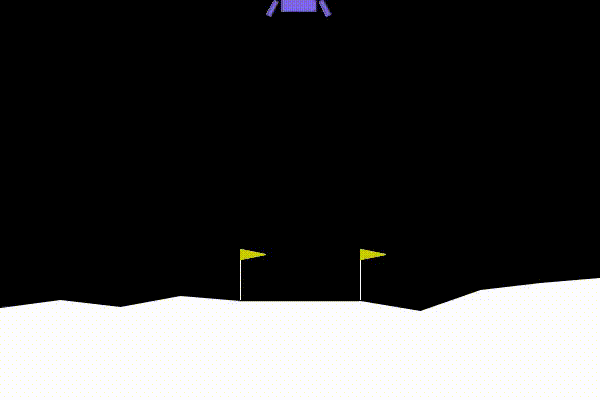

</img>

*1k steps*

## PPO

An implementation of PPO with recent random improvements

The phasic part has been removed, repository to be renamed. I do not think it does anything

## Install

```bash
$ pip install -r requirements.txt
```

You may need to install `swig`

```bash
$ apt install swig
```

## Use

```bash
$ python train.py
```

## Citations

```bibtex
@article{Schulman2017ProximalPO,
    title   = {Proximal Policy Optimization Algorithms},
    author  = {John Schulman and Filip Wolski and Prafulla Dhariwal and Alec Radford and Oleg Klimov},
    journal = {ArXiv},
    year    = {2017},
    volume  = {abs/1707.06347},
    url     = {https://api.semanticscholar.org/CorpusID:28695052}
}
```

```bibtex
@article{Zhang2024ReLU2WD,
    title   = {ReLU2 Wins: Discovering Efficient Activation Functions for Sparse LLMs},
    author  = {Zhengyan Zhang and Yixin Song and Guanghui Yu and Xu Han and Yankai Lin and Chaojun Xiao and Chenyang Song and Zhiyuan Liu and Zeyu Mi and Maosong Sun},
    journal = {ArXiv},
    year    = {2024},
    volume  = {abs/2402.03804},
    url     = {https://api.semanticscholar.org/CorpusID:267499856}
}
```

```bibtex
@inproceedings{Lee2024SimBaSB,
    title  = {SimBa: Simplicity Bias for Scaling Up Parameters in Deep Reinforcement Learning},
    author = {Hojoon Lee and Dongyoon Hwang and Donghu Kim and Hyunseung Kim and Jun Jet Tai and Kaushik Subramanian and Peter R. Wurman and Jaegul Choo and Peter Stone and Takuma Seno},
    year   = {2024},
    url    = {https://api.semanticscholar.org/CorpusID:273346233}
}
```

```bibtex
@inproceedings{anonymous2024the,
    title   = {The Complexity Dynamics of Grokking},
    author  = {Anonymous},
    booktitle = {Submitted to The Thirteenth International Conference on Learning Representations},
    year    = {2024},
    url     = {https://openreview.net/forum?id=07N9jCfIE4},
    note    = {under review}
}
```

```bibtex
@article{Yang2020LearningLD,
    title   = {Learning Low-rank Deep Neural Networks via Singular Vector Orthogonality Regularization and Singular Value Sparsification},
    author  = {Huanrui Yang and Minxue Tang and Wei Wen and Feng Yan and Daniel Hu and Ang Li and Hai Helen Li and Yiran Chen},
    journal = {2020 IEEE/CVF Conference on Computer Vision and Pattern Recognition Workshops (CVPRW)},
    year    = {2020},
    pages   = {2899-2908},
    url     = {https://api.semanticscholar.org/CorpusID:213940794}
}
```

```bibtex
@article{Farebrother2024StopRT,
    title   = {Stop Regressing: Training Value Functions via Classification for Scalable Deep RL},
    author  = {Jesse Farebrother and Jordi Orbay and Quan Ho Vuong and Adrien Ali Taiga and Yevgen Chebotar and Ted Xiao and Alex Irpan and Sergey Levine and Pablo Samuel Castro and Aleksandra Faust and Aviral Kumar and Rishabh Agarwal},
    journal = {ArXiv},
    year   = {2024},
    volume = {abs/2403.03950},
    url    = {https://api.semanticscholar.org/CorpusID:268253088}
}
```
